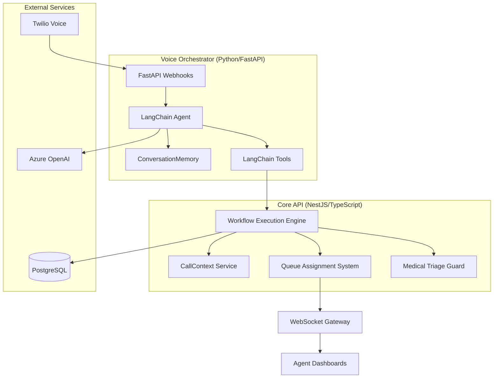
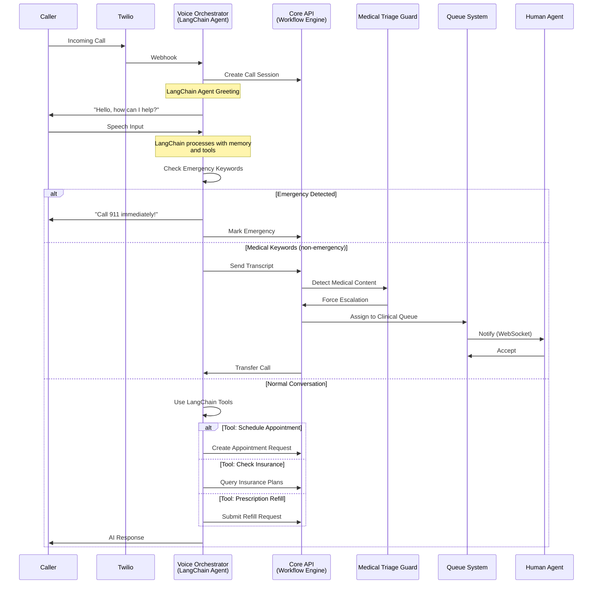
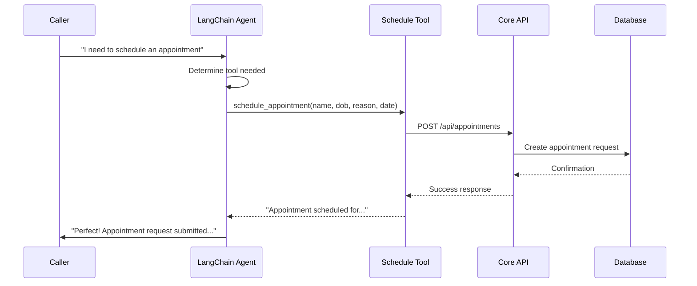

# LangChain Hybrid Architecture for Wardline Multi-Agent System

## Overview

Wardline uses a **hybrid architecture** that combines the strengths of both a custom workflow orchestration engine and LangChain-powered AI agents. This document explains how the two systems work together.

## Architecture Decision: Why Hybrid?

### What We Keep (Custom Implementation)

✅ **Workflow Orchestration Engine** - Graph-based call routing with visual editing
- Healthcare-compliance friendly with explicit workflow graphs
- Audit trail for every routing decision (HIPAA requirement)
- Deterministic, predictable behavior for critical paths
- Safety rules enforced at workflow level

✅ **Queue Management System** - Human agent coordination
- Real-time availability tracking
- Skills-based routing
- SLA monitoring and metrics
- WebSocket notifications to agents

✅ **Medical Triage Guard** - Safety enforcement
- 60+ medical keyword detection
- Automatic escalation to clinical staff
- Cannot be overridden (compliance requirement)
- Emergency alerting to supervisors

✅ **Database Schema** - Healthcare-specific data model
- Multi-tenant (hospital) architecture
- Complete audit logging
- Patient privacy controls
- Performance-optimized with indexes

### What We Add (LangChain)

✅ **AI Agent Capabilities** - Enhanced conversational AI
- Tool calling for scheduling, billing, insurance
- Multi-step reasoning and planning
- Better context retention with ConversationMemory
- Agent-to-agent communication (future)

✅ **Memory Management** - Conversation history
- ConversationBufferMemory for short-term context
- Automatic context sync between systems
- Better handling of multi-turn conversations

✅ **Tool Ecosystem** - Dynamic capability expansion
- Easy to add new tools without code changes
- Pre-built integrations from LangChain community
- Function calling with structured outputs

✅ **Observability** - LangSmith integration (future)
- AI agent behavior debugging
- Conversation quality monitoring
- Performance optimization insights

## System Architecture



## Call Flow with LangChain Integration

### Incoming Call Flow



## Component Deep Dive

### 1. Voice Orchestrator with LangChain

**Location**: `apps/voice-orchestrator-pipecat/`

**Components**:
- `langchain_agent.py` - Main agent setup with memory
- `langchain_tools.py` - Tool definitions for AI capabilities
- `server.py` - FastAPI server handling Twilio webhooks
- `call_context.py` - Call state management

**Key Features**:

```python
# Agent with memory and tools
class VoiceAgent:
    def __init__(self, context: CallContext):
        self.memory = ConversationBufferMemory()  # Retains conversation
        self.llm = AzureChatOpenAI()  # Azure OpenAI
        self.tools = create_agent_tools(context)  # Dynamic tools
        self.agent_executor = create_openai_tools_agent()
```

**Available Tools**:
1. `check_insurance` - Verify insurance acceptance
2. `schedule_appointment` - Book appointments
3. `request_prescription_refill` - Submit refill requests
4. `find_department` - Locate hospital departments
5. `transfer_to_human` - Escalate to human agent

### 2. Core API Workflow Engine

**Location**: `apps/core-api/src/modules/workflows/`

**Components**:
- `workflow-execution.service.ts` - Executes workflow nodes
- `call-context.service.ts` - Stateful context management (NEW)
- `workflow-validator.service.ts` - Validates workflows

**Key Features**:

```typescript
// Stateful context throughout call
@Injectable()
export class CallContextService {
    private contexts: Map<string, CallContext> = new Map();
    
    getOrCreate(callId: string): CallContext {
        // Returns same context instance for entire call
        // No recreation on each node execution
    }
}
```

**15 Workflow Node Types**:
- `start`, `end` - Entry/exit points
- `emergency-screen` - Emergency detection
- `intent-detect` - Intent classification
- `ai-agent` - Configure AI behavior
- `human-agent-queue` - Route to queue
- `human-agent-direct` - Direct assignment
- `safety-check` - Medical keyword check
- `conditional` - If/else routing
- `collect-info` - Gather information
- `integration` - External API calls
- `question`, `route`, `webhook` - Additional routing

### 3. Queue System

**Location**: `apps/core-api/src/modules/queues/`

**Components**:
- `queues.service.ts` - Queue management
- `queue-assignment.service.ts` - Agent assignment
- Assignment strategies: skill-based, round-robin, least-busy, priority

**Real-time Features**:
- WebSocket notifications to agents
- Live queue metrics (depth, wait time, SLA)
- Capacity management (maxConcurrentCalls)

### 4. Medical Triage Guard

**Location**: `apps/core-api/src/modules/safety/medical-triage-guard.service.ts`

**Safety Enforcement**:
- 60+ medical keywords monitored
- Automatic escalation (cannot be overridden)
- Emergency supervisor alerts
- 100% audit trail in database

## Context Management Strategy

### Problem Identified
**Before**: CallContext was recreated on each workflow node execution, losing in-memory state.

### Solution Implemented
**After**: CallContextService maintains stateful context throughout entire call lifecycle.

```typescript
// Workflow Execution Service
async executeNode(node, callContext, workflow) {
    // Get or create stateful context (persists across nodes)
    const context = this.callContextService.getOrCreate(
        callContext.callId, 
        callContext
    );
    
    // Execute node with persistent context
    return this.executeAIAgent(node, context);
}
```

### Context Flow

1. **Call Starts** → Voice Orchestrator creates CallContext
2. **Each Node** → Core API retrieves same context from CallContextService
3. **Updates** → Both systems sync context changes
4. **Agent Handoff** → Full context available to human agent
5. **Call Ends** → Context cleaned up from memory

## Memory Architecture

### LangChain Memory (Voice Orchestrator)

```python
from langchain.memory import ConversationBufferMemory

memory = ConversationBufferMemory(
    memory_key="chat_history",
    return_messages=True,
    output_key="output",
    input_key="input",
)

# Automatically tracks:
# - User messages
# - AI responses  
# - Tool calls and results
```

### Stateful Context (Core API)

```typescript
@Injectable()
export class CallContextService {
    // In-memory storage
    private contexts: Map<string, CallContext> = new Map();
    
    // Tracks:
    // - Full transcript
    // - Extracted fields
    // - Detected intent
    // - Sentiment analysis
    // - Emergency status
}
```

### Context Sync Points

1. **After each AI turn** → Memory synced to CallContext
2. **Before workflow execution** → CallContext synced to memory
3. **On tool execution** → Updates propagated bidirectionally
4. **On escalation** → Complete context handed to human agent

## Tool Execution Flow

### Example: Schedule Appointment Tool



### Tool Implementation

```python
# langchain_tools.py
async def schedule_appointment_tool(
    patient_name, patient_dob, patient_phone, 
    reason, preferred_date, preferred_time, context
):
    # Store in context for workflow access
    context.collect_field("patient_name", patient_name, confirmed=True)
    
    # In production, call scheduling integration
    # await api_client.create_appointment(...)
    
    return f"Appointment scheduled for {preferred_date}"

# Register as LangChain tool
StructuredTool.from_function(
    coroutine=schedule_appointment_tool,
    name="schedule_appointment",
    description="Schedule a medical appointment...",
    args_schema=ScheduleAppointmentInput,
)
```

## Safety Rules Integration

### How Safety Works with LangChain

```python
# In LangChain agent
async def generate_response(user_input):
    # FIRST: Check emergencies (bypass agent)
    if self._is_emergency(user_input):
        return "This is an emergency. Call 911!"
    
    # SECOND: Run LangChain agent with tools
    result = await self.agent_executor.ainvoke({"input": user_input})
    
    # THIRD: Medical Triage Guard validates in workflow
    # (if transcript contains medical keywords)
```

### Safety Layers

1. **Layer 1**: LangChain agent emergency detection (immediate)
2. **Layer 2**: Medical Triage Guard keyword analysis (continuous)
3. **Layer 3**: Workflow safety-check nodes (explicit)
4. **Layer 4**: Human override capability (clinical staff only)

## When to Use Which System

### Use Workflow Engine For:

✅ **Deterministic routing** - "If intent is billing, route to billing queue"
✅ **Compliance requirements** - "All medical discussions must go to clinical staff"
✅ **Human agent coordination** - Queue management, assignments, transfers
✅ **Safety enforcement** - Medical keyword detection, emergency escalation
✅ **Audit requirements** - Every decision logged to database

### Use LangChain Agent For:

✅ **Conversational AI** - Natural language understanding and generation
✅ **Tool execution** - Scheduling, insurance checks, information lookup
✅ **Context retention** - Multi-turn conversations with memory
✅ **Dynamic capabilities** - Adding new tools without code changes
✅ **Agent reasoning** - "Should I check insurance first or schedule?"

### Example Decision Matrix

| Scenario | System to Use | Reasoning |
|----------|---------------|-----------|
| Caller says "chest pain" | **Both**: LangChain detects → Workflow forces escalation | Safety-critical |
| Caller asks about insurance | **LangChain**: Use check_insurance tool | Dynamic query |
| Route call to specific queue | **Workflow**: Explicit routing rules | Deterministic |
| Multi-turn appointment scheduling | **LangChain**: Memory + tools | Conversational |
| Validate workflow graph | **Workflow**: Validation service | Compliance |
| Optimize AI responses | **LangChain**: LangSmith observability | AI improvement |

## Future Enhancements

### Multi-Agent Collaboration (LangGraph)

```python
from langgraph import StateGraph

# Example: Billing agent consults scheduling agent
graph = StateGraph(AgentState)
graph.add_node("billing_agent", billing_agent_node)
graph.add_node("scheduling_agent", scheduling_agent_node)
graph.add_node("supervisor", supervisor_node)

# Billing agent: "Let me check with scheduling about availability"
# Scheduling agent: "We have slots on Tuesday at 2pm"
# Billing agent: "Great, that date works with their insurance"
```

### Semantic Memory (Long-term)

```python
from langchain.memory import ConversationSummaryMemory

# Summarize long conversations
memory = ConversationSummaryMemory(
    llm=llm,
    max_token_limit=500
)

# "Patient called 3 times about billing. Resolved by waiving copay."
```

### Agent Handoff with Context

```python
# When transferring to human agent
summary = agent.get_conversation_summary()

# WebSocket to human agent dashboard:
{
    "call_id": "abc123",
    "summary": "Caller needs appointment, prefers Tuesday 2pm, has Blue Cross",
    "collected_fields": {...},
    "sentiment": "neutral",
    "urgency": 0.6
}
```

## Setup and Installation

### 1. Install LangChain Dependencies

```bash
cd apps/voice-orchestrator-pipecat
pip install -r requirements.txt
```

Dependencies added:
- `langchain>=0.1.0`
- `langchain-openai>=0.0.5`
- `langgraph>=0.0.20`

### 2. Configure Environment

No new environment variables required! LangChain uses existing Azure OpenAI credentials:

```env
# .env (already configured)
AZURE_OPENAI_KEY=your-key
AZURE_OPENAI_ENDPOINT=https://your-endpoint.openai.azure.com/
AZURE_OPENAI_DEPLOYMENT=o4-mini
AZURE_OPENAI_API_VERSION=2024-12-01-preview
```

### 3. Start Services

```bash
# Core API (NestJS)
pnpm --filter @wardline/core-api dev

# Voice Orchestrator (Python)
cd apps/voice-orchestrator-pipecat
python server.py
```

### 4. Test LangChain Integration

```bash
# Call your Twilio number
# Try: "I need to schedule an appointment"
# The AI will use the schedule_appointment tool!

# Check logs:
# - "🤖 Agent created with 5 tools"
# - "Memory initialized with X messages"
# - "Tool executed: schedule_appointment"
```

## Monitoring and Debugging

### Core API Logs

```bash
# View workflow executions
tail -f apps/core-api/logs/application.log | grep "Executing node"

# View context updates
tail -f apps/core-api/logs/application.log | grep "CallContextService"
```

### Voice Orchestrator Logs

```bash
# View LangChain agent activity
tail -f apps/voice-orchestrator-pipecat/logs/voice_orchestrator.log | grep "Agent"

# View tool executions
tail -f apps/voice-orchestrator-pipecat/logs/voice_orchestrator.log | grep "Tool"
```

### Database Queries

```sql
-- View call context snapshots
SELECT id, twilio_call_sid, status, tag, is_emergency
FROM call_sessions
WHERE started_at > NOW() - INTERVAL '1 hour';

-- View safety events
SELECT * FROM audit_logs
WHERE action = 'SAFETY_EVENT'
ORDER BY created_at DESC
LIMIT 10;

-- View agent assignments
SELECT ca.*, a.name as agent_name, q.name as queue_name
FROM call_assignments ca
LEFT JOIN agents a ON ca.agent_id = a.id
LEFT JOIN call_queues q ON ca.queue_id = q.id
ORDER BY ca.created_at DESC;
```

## Best Practices

### 1. Keep Workflows Simple

❌ **Bad**: Complex AI logic in workflow nodes
```typescript
// Don't: AI decision-making in workflow
if (aiConfidence > 0.8 && sentiment > 0.6) {
    // Complex branching...
}
```

✅ **Good**: Delegate to LangChain agent
```typescript
// Do: Let LangChain handle complexity
case 'ai-agent':
    return this.executeAIAgent(node, context);
```

### 2. Use Tools for All External Actions

❌ **Bad**: Direct API calls in AI responses
```python
# Don't: Hardcode actions in prompts
"I scheduled your appointment for Tuesday" # Didn't actually schedule!
```

✅ **Good**: Use LangChain tools
```python
# Do: Use tools for actions
@tool
async def schedule_appointment(...):
    await api_client.create_appointment(...)
    return "Appointment scheduled!"
```

### 3. Sync Context Bidirectionally

❌ **Bad**: One-way context flow
```python
# Don't: Forget to update context
result = agent.generate_response(input)
# Context not synced!
```

✅ **Good**: Keep systems in sync
```python
# Do: Sync after each turn
result = agent.generate_response(input)
agent.update_context()  # Sync to CallContext
```

### 4. Validate Safety at Multiple Layers

❌ **Bad**: Single point of safety check
```python
# Don't: Only check once
if "chest pain" in input:
    escalate()
```

✅ **Good**: Defense in depth
```python
# Do: Multiple safety layers
# 1. LangChain agent checks
# 2. Medical Triage Guard analyzes
# 3. Workflow safety nodes enforce
# 4. Database audit logs everything
```

## Troubleshooting

### Issue: Agent not using tools

**Symptom**: AI responds with text but doesn't execute tools

**Solution**: Check tool descriptions are clear

```python
# Bad description
description="Schedule appointments"

# Good description  
description="Schedule a medical appointment. Use when caller asks to book, schedule, or make an appointment. Requires patient name, DOB, phone, and preferred date."
```

### Issue: Context not persisting

**Symptom**: AI forgets previous conversation

**Solution**: Verify memory initialization

```python
# Check agent has memory
agent = agent_manager.get_or_create_agent(context)
assert len(agent.memory.chat_memory.messages) > 0
```

### Issue: Safety check not triggering

**Symptom**: Medical keywords not escalating

**Solution**: Check multiple detection points

1. Voice Orchestrator emergency check
2. Medical Triage Guard keyword list
3. Workflow safety-check node configuration
4. Audit logs for safety events

## Summary

The **hybrid architecture** combines:

1. ✅ **LangChain** for intelligent, conversational AI with tools and memory
2. ✅ **Custom Workflow Engine** for compliance, safety, and human coordination
3. ✅ **Stateful Context** maintained throughout call lifecycle
4. ✅ **Bidirectional Sync** between both systems

This approach gives you:
- **Best of both worlds**: AI flexibility + compliance rigor
- **Safety first**: Multiple layers of protection
- **Scalability**: Add tools without changing workflows
- **Observability**: Complete audit trail + AI monitoring

Your multi-agent system is now **production-ready** with enterprise-grade AI capabilities! 🚀
